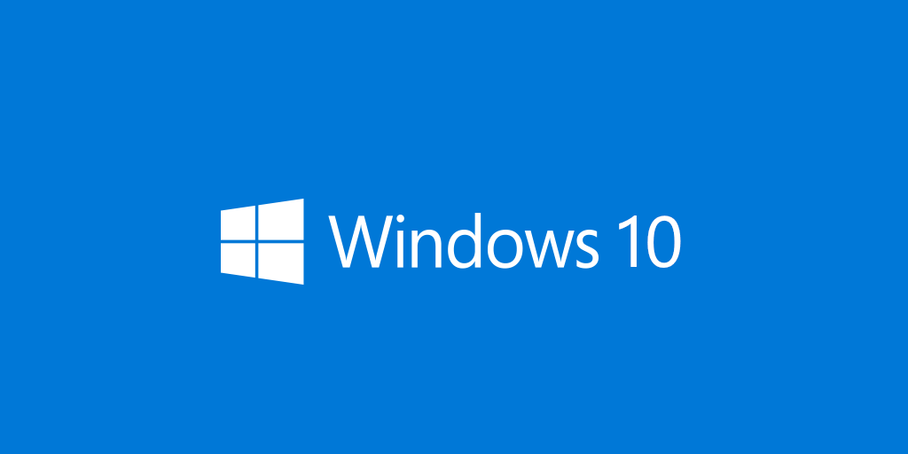
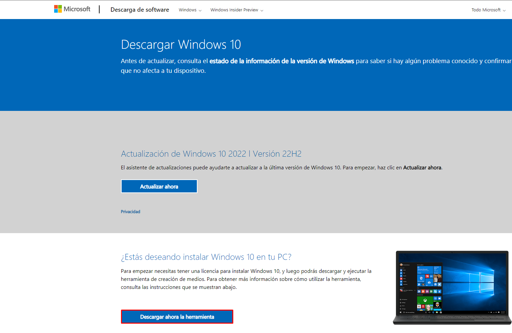
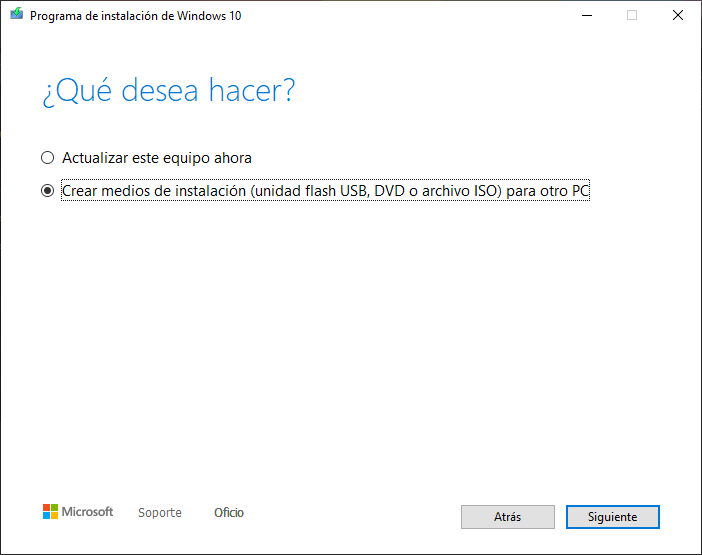
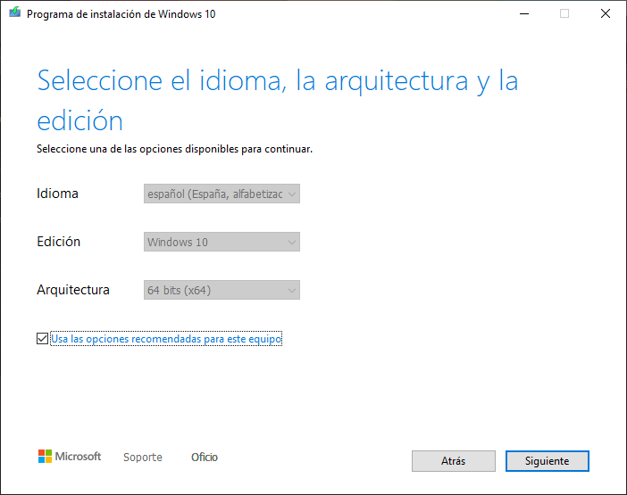
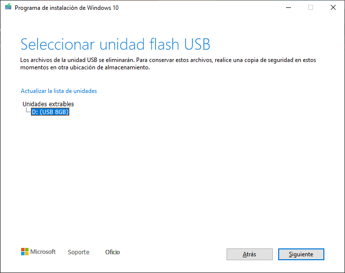
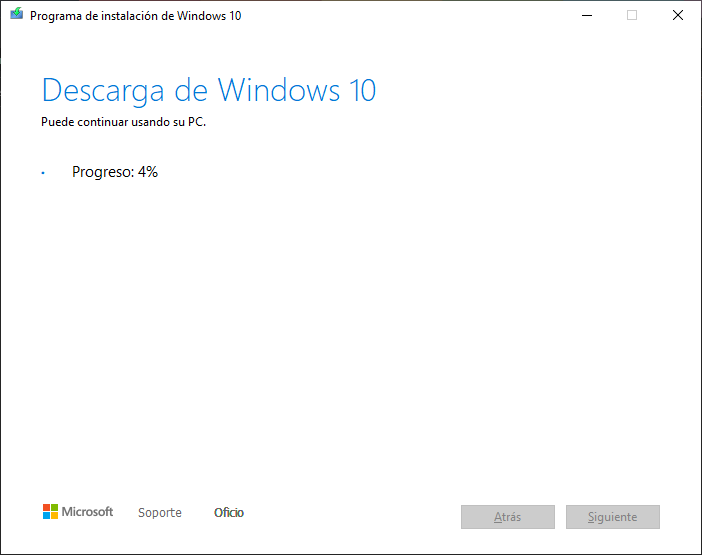
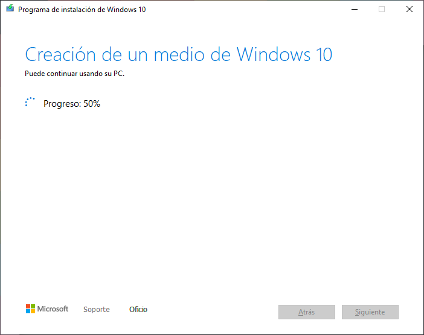
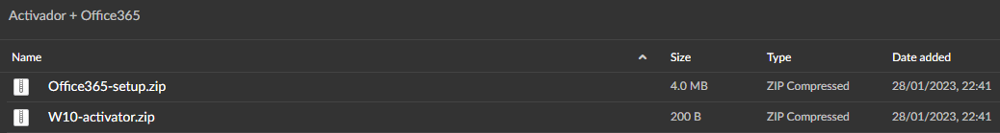

> ❗ ***IMPORTANTE***
>
> La instalación de Windows 10 se hace a través de la herramienta de actualización oficial, pero también se hace uso de software no oficial 🏴‍☠️.

<h3>Tabla de contenido</h3>

- [1. Creación de imagen de Windows 10](#1-creación-de-imagen-de-windows-10)
  - [1.1. Descarga de herramienta de instalación de Windows 10](#11-descarga-de-herramienta-de-instalación-de-windows-10)
  - [1.2. Realización de preparativos](#12-realización-de-preparativos)
  - [1.3. ¿Qué desea hacer?](#13-qué-desea-hacer)
  - [1.4. Selección de idioma, arquitectura y edición](#14-selección-de-idioma-arquitectura-y-edición)
  - [1.5. Ubicación donde crear la imagen](#15-ubicación-donde-crear-la-imagen)
  - [1.6. Seleccionar unidad flash USB](#16-seleccionar-unidad-flash-usb)
  - [1.7. Descarga del sistema operativo](#17-descarga-del-sistema-operativo)
  - [1.8. Imagen de Windows 10 lista](#18-imagen-de-windows-10-lista)
- [2. Inicio de imagen de instalación Windows 10](#2-inicio-de-imagen-de-instalación-windows-10)
  - [2.1. Configuración de disco de arranque](#21-configuración-de-disco-de-arranque)
    - [2.1.1. Alternativa](#211-alternativa)
- [3. Instalación de Windows 10](#3-instalación-de-windows-10)
- [4. Activación de Windows 10](#4-activación-de-windows-10)
  - [4.1. Ejecutar activador](#41-ejecutar-activador)

---

# 1. Creación de imagen de Windows 10

## 1.1. Descarga de herramienta de instalación de Windows 10

|                     🔗 Enlace de descarga                     | https://www.microsoft.com/es-es/software-download/windows10 	|
|:-----------------------------------------------------------:	|:-----------------------------------------------------------:	|

Se pulsa al botón **Descargar ahora la herramienta**.

Una vez se ha descargado la herramienta de instalación de Windows 10, se ejecuta el **archivo descargado** para abrir el **asistente** que nos ayudará a **crear la imagen del sistema operativo** que se instalará en el portátil al que queremos instalarle Windows 10.

## 1.2. Realización de preparativos

Cuando se lanza la herramienta, comienza a realizar algunos preparativos y pide que se acepten los términos de licencia. **Habrá que aceptarlos** para continuar con el proceso.

## 1.3. ¿Qué desea hacer?

Desde esta herramienta tenemos la oportunidad de **actualizar el equipo** en el que se está utilizando la herramienta *(para pasar de W7 a W10, por ejemplo)* o **crear una imagen de Windows 10** para instalar en otros equipos. Esta última opción será la escogida.

  

## 1.4. Selección de idioma, arquitectura y edición

Se podrá seleccionar el idioma, la arquitectura y la edición que se quiere de Windows 10.

En este caso, serán las mismas opciones que las que se recomienda para el equipo desde el que se está creando la imagen.

  

## 1.5. Ubicación donde crear la imagen

A continuación, la herramienta nos pide que elijamos entre instalar la imagen en un USB directamente o descargar la imagen `.iso` del sistema operativo.

Seleccionamos la opción de crear imagen en la memoria flash USB para ahorrarnos el tener que hacerlo nosotros posteriormente.

## 1.6. Seleccionar unidad flash USB

> ⚠ ***CUIDADO***
> 
> El USB será formateado. Esto quiere decir que **se perderá toda la información** que hay en él. Haz una copia de seguridad de lo que hay en él.

Si todavía no se ha introducido el USB en el ordenador, este es el momento de hacerlo.

Si no aparece la unidad USB, se debe pulsar en el enlace *Actualizar la lista de unidades*.
  

  

## 1.7. Descarga del sistema operativo

Después de los pasos anteriores, el Programa de instalación de Windows 10 comenzará a descargar e instalar el sistema operativo con la configuración seleccionada.
  

  

  

  

## 1.8. Imagen de Windows 10 lista

Cuando el programa termine de hacer lo suyo, nos avisará de ello y podremos cerrarlo.

Con esto, ya podemos ponernos manos a la obra 🛠 con la instalación del sistema operativo.

# 2. Inicio de imagen de instalación Windows 10

Tras haber retirado correctamente el USB del ordenador en que acabamos de realizar todo los pasos previos, insertamos el mismo USB en el ordenador en el que queremos instalar el sistema operativo.

## 2.1. Configuración de disco de arranque

Comenzando con el ordenador apagado y el USB conectado, encendemos el ordenador y pulsamos repetidas veces las teclas `F2` o `Del` para iniciar la UEFI y así poder seleccionar que queremos que inicie con el USB.



### 2.1.1. Alternativa

Si esto no funcionase, también se puede intentar acceder al menú de selección de disco de arranque siguiendo los pasos anteriores, pero pulsando la tecla `F8`.

# 3. Instalación de Windows 10

Es una configuración bastante guiada *(es de darle a "siguiente" casi todo el rato)*.

# 4. Activación de Windows 10

| 🔗 Enlace a recursos 	| https://mega.nz/folder/8jQWgaxb 	|
|:-------------------:	|:-------------------------------:	|

Al acceder al enlace, se pedirá la **clave de descifrado**.

Nos descargamos al menos el archivo comprimido `W10-activador.zip`.

## 4.1. Ejecutar activador

Una vez descargado:

1. Se abre la carpeta en la que se ha descargado 
2. Se extrae el contenido del `.zip`
3. Se ejecuta con **permisos de administrador**

> Aparecerán tres mensajes del sistema.
> 
> Hay que esperar a que aparezca el mensaje de que la clave ha sido instalada correctamente.
